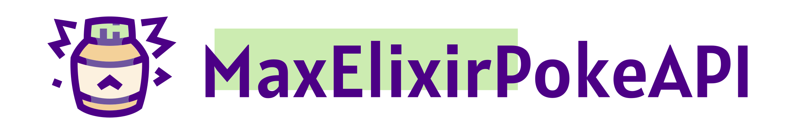

<p align="center">
  
  
  
  <a href="https://gitmoji.dev">
    
  </a>
</p>

MaxElixirPokeApi is a Elixir wrapper with auto caching for [PokeAPI](https://pokeapi.co/).

All API references explicit in [PokeAPI Doc](https://pokeapi.co/docs/v2).

To see all documentation access [https://hexdocs.pm/max_elixir_poke_api](https://hexdocs.pm/max_elixir_poke_api).

## 📥 Installation

As of v1.1.0, MaxElixirPokeAPI is available on [Hex](https://hex.pm/). You can install the package via:

```elixir
def deps do
  {:max_elixir_poke_api, "~> 1.1.0"}
end
```

## 🔄 Usage

To use the resources just call `MaxElixirPokeApi.<resource_name>(id_or_name)`.

```elixir
MaxElixirPokeApi.berry(1)
```

To list resources use `MaxElixirPokeApi.resource(resource_aton, limit, page)`.

```elixir
MaxElixirPokeApi.resource(:berry, 5, 5)
```

## 🤝 Contribute

I value every contribution, no matter how big or small. Here are the steps to get started with contributing:

1. 🍴 Fork the Repository
  
    To begin contributing, fork our repository on GitHub. This will create a copy of the project in your GitHub account, allowing you to make changes without affecting the main project directly.

2. 🤡 Clone the Repository

    After forking the repository, clone it to your local machine using the following command:
    
    `git clone git@github.com:your-username/Max-Elixir-PokeAPI.git`
    
    Be sure to replace your-username with your GitHub username.

3. 📂 Create a New Branch

    For each contribution or bug fix, create a new branch from the  `master` branch using a descriptive name that reflects the nature of your changes. This helps keep the project organized and makes it easier for others to review your code.

    `git checkout -b feature/your-feature`

4. ✨ Make Changes

    Now, you can start making the necessary changes to the codebase.

5. 🧪 Test

    Also, don't forget to write tests for the new functionality or bug fix you're implementing.

    To run unit tests use: `mix test`

    to run api connection tests use: `mix test --include request_api`

    _Before opening the PR for all tests including `api connection`_.

6. 😜 Commit and Push

    Once you've made your changes and tested them thoroughly, commit your work using [Gitmoji](https://gitmoji.dev/). To create the commit I suggest using [gitmoji-cli](https://github.com/carloscuesta/gitmoji-cli).

    ```bash
    git add .
    gitmoji -c
    git push origin feature/your-feature
    ```

7. 🛎️ Create a Pull Request

    When you're ready to submit your contribution, navigate to the original repository on GitHub and create a Pull Request (PR) from your branch. In the PR description, provide a clear explanation of your changes, including why they are necessary and any potential impacts.

    I will review your PR as soon as possible. I may provide feedback or ask for additional changes before merging the code.


---

 Special thanks to [Tito](https://www.behance.net/titomarques) who made the logo!